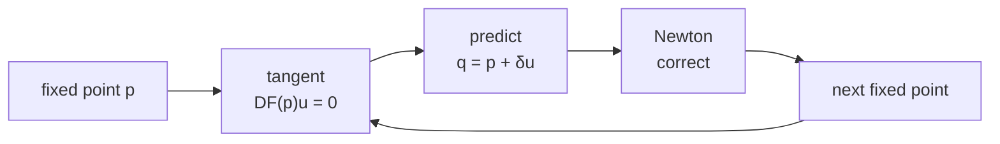
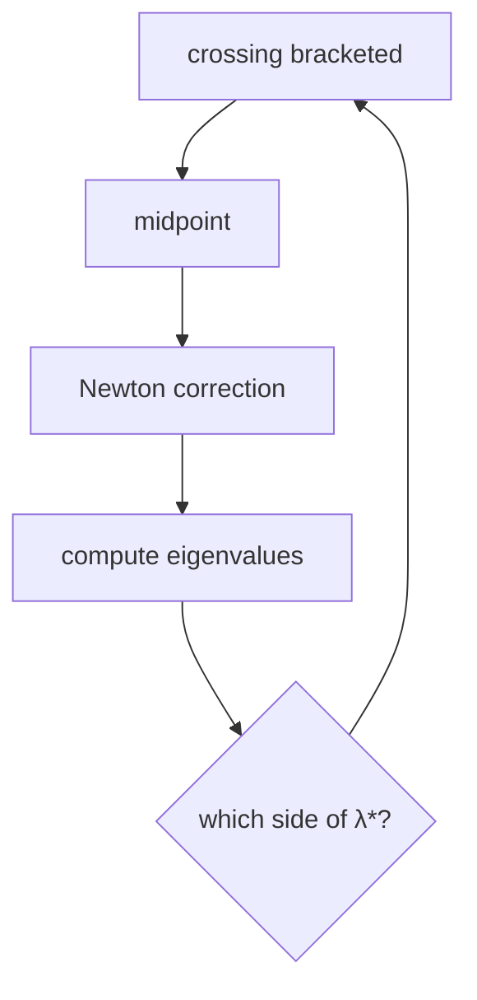
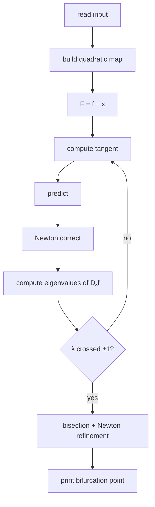

<p align="center">
  
</p>

<p align="center">
  <b>Numerical continuation of fixed points in parameter-dependent quadratic maps.</b><br>
  Follow the branch. Track the spectrum. Detect the bifurcation.
</p>

<p align="center">
  
  
  
  
</p>

---

## The idea

We study a discrete dynamical system

\[
x_{k+1}=f(x_k,\mu),
\]

where the last variable \(\mu\) is treated as a parameter.

A fixed point satisfies

\[
f(x,\mu)=x.
\]

So define

\[
\boxed{F(x,\mu)=f(x,\mu)-x}.
\]

Then fixed points are exactly the points satisfying

\[
\boxed{F(x,\mu)=0}.
\]

There are \(n\) equations and \(n+1\) unknowns, so—under regularity assumptions—the solutions form a **curve** in state–parameter space.

<p align="center">
  
</p>

<p align="center">
  <sub>
    Yellow: current fixed point · Red: predictor · Green: Newton correction
  </sub>
</p>

---

## Following the branch

At a known fixed point \(p\), a tangent vector \(u\) satisfies

\[
\boxed{DF(p)\,u=0},
\qquad
\|u\|_2=1.
\]

The next point is predicted by

\[
q=p+\delta u,
\qquad
\delta=0.005.
\]

The predictor is generally not exactly on the fixed-point curve, so Newton's method corrects it back to

\[
F(p)=0.
\]



This is why the algorithm can continue through curved branches where using the parameter \(\mu\) alone as the continuation variable would fail.

---

## Where does the bifurcation appear?

For each fixed point we compute the **state Jacobian**

\[
J_x=D_xf(x,\mu)
\]

and its eigenvalues

\[
\lambda_1,\ldots,\lambda_n.
\]

The solver searches for one of two spectral events:

<table align="center">
<tr>
<td align="center"><b>Fold</b></td>
<td align="center"><b>Flip / period doubling</b></td>
</tr>
<tr>
<td align="center">\(\lambda=+1\)</td>
<td align="center">\(\lambda=-1\)</td>
</tr>
</table>

<p align="center">
  
</p>

When the eigenvalue closest to the target crosses it, the solver brackets the event and refines the bifurcation point.

\[
g(p)=\lambda_{\text{closest}}(p)-\lambda_{\text{target}}.
\]

A sign change in \(g\) means that the target eigenvalue has been crossed.

---

## Refinement

Once the crossing is detected between two continuation points,

\[
p_a,\qquad p_b,
\]

the interval is repeatedly bisected:

\[
p_m=\frac{p_a+p_b}{2}.
\]

Each midpoint is corrected back to the fixed-point curve with Newton's method, and its eigenvalues are recomputed.

The implementation performs **100 refinement steps**.



---

## Quadratic maps

Every component of \(f\) is a polynomial of degree at most two.

For

\[
p=(x_1,\ldots,x_n,\mu)
\]

the monomial basis is

\[
1,\quad
x_1,\ldots,x_{n+1},\quad
x_1^2,x_1x_2,\ldots,x_{n+1}^2.
\]

Its size is

\[
\boxed{k=\frac{(n+3)(n+2)}{2}}.
\]

For \(n=2\), the basis is

\[
1,x,y,z,x^2,xy,xz,y^2,yz,z^2.
\]

The Jacobian is constructed **analytically** from these coefficients—no finite differences are needed.

---

## Algorithm at a glance



---

## Example — Hénon-type map

\[
f(x,y,z)=
\left(
1+y-\frac12x^2,\,
xz
\right).
\]

Start from

\[
(x,y,z)=(-1,-1.5,1.5)
\]

and search for a **flip bifurcation**

\[
\lambda=-1.
\]

The solver finds approximately

\[
\boxed{
(x,y,z)=
(-0.816496580927726,\,
-1.483163247594393,\,
1.816496580927726)
}
\]

with eigenvalues

\[
\boxed{
-1,\qquad
1.816496580927726
}.
\]

So the first eigenvalue reaches exactly the flip threshold.

---

## Run

```bash
python bif.py < input.txt
```

No external dependencies are required.

---

## Numerical ingredients

| Component | Method |
|---|---|
| Fixed-point equation | \(F=f-x\) |
| Branch direction | nullspace of \(DF\) |
| Predictor | \(p+\delta u\) |
| Corrector | Newton method |
| Linear systems | Gaussian elimination |
| \(n=1\) eigenvalues | direct |
| \(n=2\) eigenvalues | analytical formula |
| \(n>2\) eigenvalues | QR iteration |
| Bifurcation detection | eigenvalue crossing |
| Final localization | bisection + Newton |
| Output | 17-digit scientific notation |

---

<p align="center">
  <b>The geometry tells us where to move.</b><br>
  <b>The spectrum tells us when the dynamics change.</b>
</p>

<p align="center">
  <sub>Numerical continuation · fixed points · eigenvalues · bifurcations</sub>
</p>
