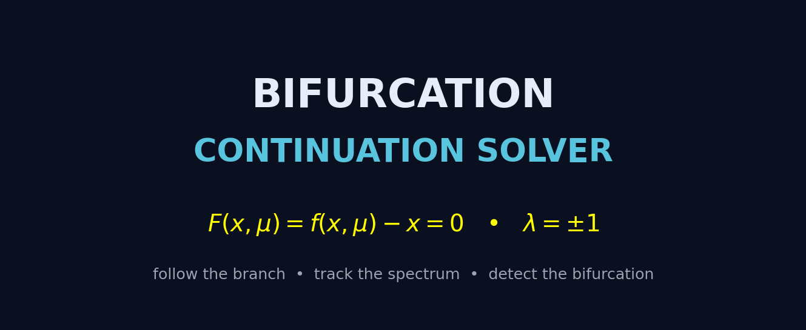
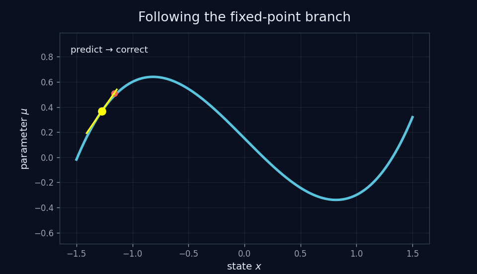
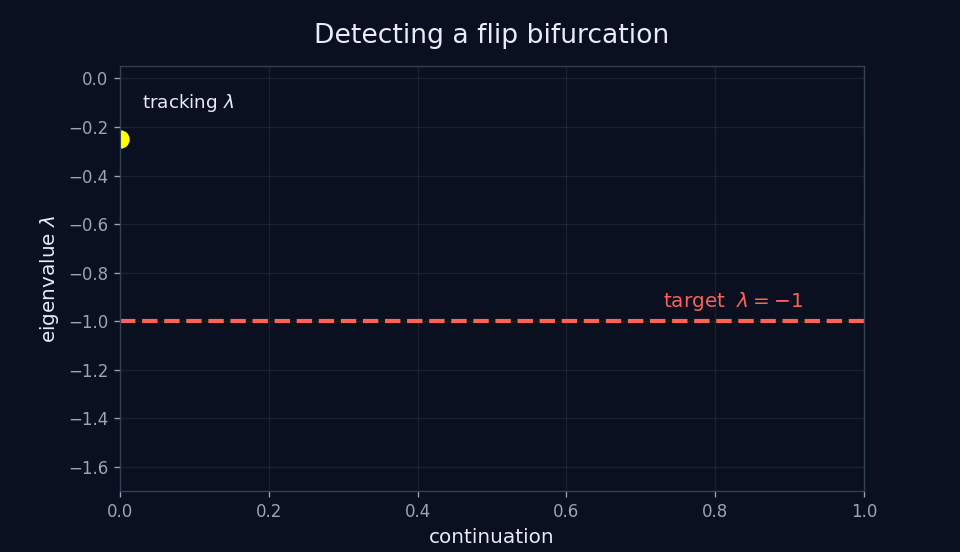
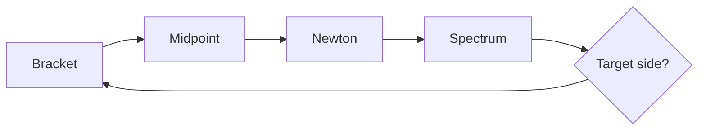
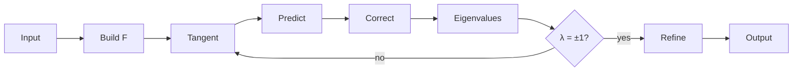

<p align="center">
  
</p>

<p align="center">
  <b>Numerical continuation of fixed points in parameter-dependent quadratic maps.</b><br>
  Follow the branch · track the spectrum · detect the bifurcation
</p>

<p align="center">
  
  
  
  
  
</p>

---

## The idea

We study a discrete dynamical system

$$
x_{k+1}=f(x_k,\mu),
$$

where $\mu$ is the continuation parameter.

A fixed point satisfies

$$
f(x,\mu)=x.
$$

So define

$$
\boxed{F(x,\mu)=f(x,\mu)-x}.
$$

The branch of fixed points is therefore

$$
\boxed{F(x,\mu)=0}.
$$

There are $n$ equations in $n+1$ variables, so the solutions generically form a **curve** in state–parameter space.

<p align="center">
  
</p>

<p align="center">
  <sub>current point → tangent prediction → Newton correction</sub>
</p>

---

## Follow the branch

At a fixed point $p$, a tangent vector $u$ satisfies

$$
DF(p)\,u=0,
\qquad
\|u\|_2=1.
$$

The predictor step is

$$
\boxed{q=p+\delta u},
\qquad
\delta=0.005.
$$

Newton's method then brings the predicted point back to the curve $F=0$.


---

## Detect the bifurcation

At every fixed point we compute the state Jacobian

$$
J_x=D_xf(x,\mu)
$$

and its eigenvalues

$$
\lambda_1,\ldots,\lambda_n.
$$

| Bifurcation | Spectral condition |
|---|---:|
| **Fold** | $\lambda=+1$ |
| **Flip / period doubling** | $\lambda=-1$ |

<p align="center">
  
</p>

We track the eigenvalue closest to the requested target:

$$
g(p)=\lambda_{\mathrm{closest}}(p)-\lambda_{\mathrm{target}}.
$$

A sign change of $g$ means that the target eigenvalue has been crossed.

---

## Refine the crossing

Once the crossing is bracketed between $p_a$ and $p_b$, we bisect:

$$
p_m=\frac{p_a+p_b}{2}.
$$

The midpoint is corrected with Newton's method and the eigenvalues are recomputed.

The implementation performs **100 refinement iterations**.



---

## Quadratic maps

Every component of $f$ has degree at most two.

For

$$
p=(x_1,\ldots,x_n,\mu),
$$

the basis is

$$
1,\;
x_1,\ldots,x_{n+1},\;
x_1^2,x_1x_2,\ldots,x_{n+1}^2.
$$

Its size is

$$
\boxed{k=\frac{(n+3)(n+2)}{2}}.
$$

For $n=2$:

$$
1,x,y,z,x^2,xy,xz,y^2,yz,z^2.
$$

The Jacobian is built **analytically** from these coefficients.

---

## Algorithm at a glance



---

## Example — Hénon-type map

The map is

$$
\boxed{
f(x,y,z)=
\left(
1+y-\frac{1}{2}x^2,\;
xz
\right)
}
$$

with initial fixed point

$$
(x,y,z)=(-1,-1.5,1.5).
$$

We search for a **flip bifurcation**:

$$
\lambda_{\mathrm{target}}=-1.
$$

The solver finds

$$
\boxed{
(x,y,z)\approx
(-0.816496580927726,\;
-1.483163247594393,\;
1.816496580927726)
}
$$

with eigenvalues

$$
\boxed{
\lambda_1=-1,
\qquad
\lambda_2\approx1.816496580927726
}.
$$

The first eigenvalue reaches the flip threshold exactly.

---

## Run

```bash
python bif.py < input.txt
```

No external dependencies are required.

---

## Numerical ingredients

| Component | Method |
|---|---|
| Fixed-point equation | $F=f-x$ |
| Branch direction | nullspace of $DF$ |
| Predictor | $p+\delta u$ |
| Corrector | Newton method |
| Linear systems | Gaussian elimination |
| $n=1$ eigenvalues | direct |
| $n=2$ eigenvalues | analytical formula |
| $n>2$ eigenvalues | QR iteration |
| Detection | eigenvalue crossing |
| Refinement | bisection + Newton |
| Output | 17-digit scientific notation |

---

<p align="center">
  <b>The geometry tells us where to move.</b><br>
  <b>The spectrum tells us when the dynamics change.</b>
</p>
